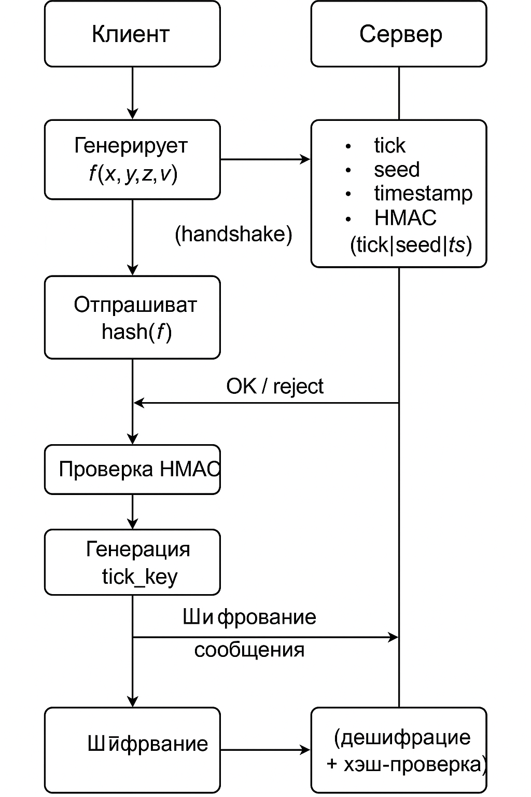

Tick-Based Encryption PoC(Teeth-gnashing)

Описание

Демонстрация PoC протокола потокового шифрования на основе tick массива с async handshake


Запуск

Сервер
```python
pip install fastapi uvicorn

python server.py
```
Клиент
```python
pip install aiohttp

python client.py
```





TODO

L2 реализация, инкапсуляция/обфускация/stealth(когда нибудь)


Сквозное решение(возможно)


Licenced under MIT

Со всеми вытекающими

